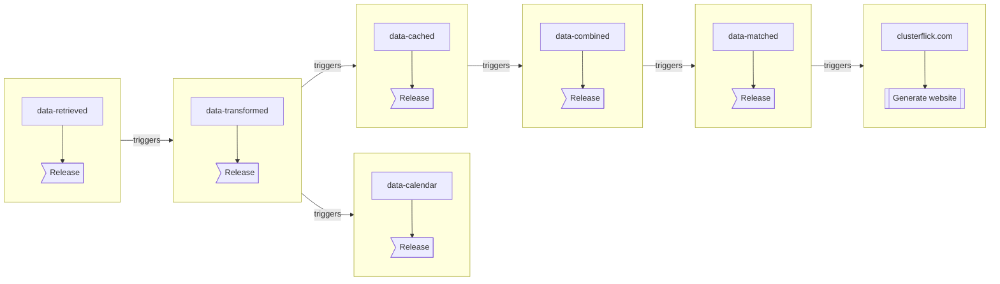

# Clusterflick

This is the Github org managing code which powers ClusterFlick.com &mdash; Just looking to see what movies are showing, head over to https://clusterflick.com/

## Pipeline

```mermaid
flowchart LR
    retrieved["data-retrieved"]
    transformed["data-transformed"]
    calendar["data-calendar"]
    cached["data-cached"]
    combined["data-combined"]
    matched["data-matched"]

    subgraph retrival[" "]
        direction TB
        retrieved --> retrival-release>Release]
    end

    subgraph transformation[" "]
        direction TB
        transformed --> transformation-release>Release]
    end

    subgraph calendars[" "]
        direction TB
        calendar --> calendar-release>Release]
    end

    subgraph caching[" "]
        direction TB
        cached --> cached-release>Release]
    end

    subgraph combination[" "]
        direction TB
        combined --> combined-release>Release]
    end

    subgraph matching[" "]
        direction TB
        matched --> matched-release>Release]
    end

    subgraph website[" "]
        direction TB
        clusterflick.com --> id1[[Generate website]]
    end

    retrival --triggers--> transformation
    transformation --triggers--> calendars
    transformation --triggers--> caching
    caching --triggers--> combination
    combination --triggers--> matching
    matching --triggers--> website

```

