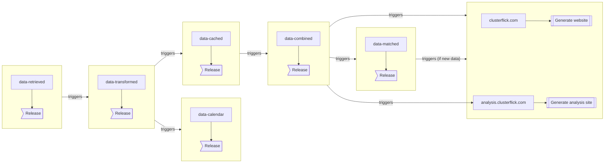

# Clusterflick

This is the Github org for the code that powers ClusterFlick 🍿

🎬 Looking to see what movies are showing? View them at https://clusterflick.com

## Build Status

1. 
2. 
   - 
   - 
3. 
   -  _(triggers website if not skipped)_
   - `clusterflick.com` 
   - `analysis.clusterflick.com` 

## Pipeline

## Tooling Status

### Development

- `scripts` 
- `clusterflick.com` 

### Social Media / Spotlights

- 
- 
- 

### Data Maintenance

- 
- 
- 
- 

### Self-hosted Runner Maintenance

- 
- 
- 
