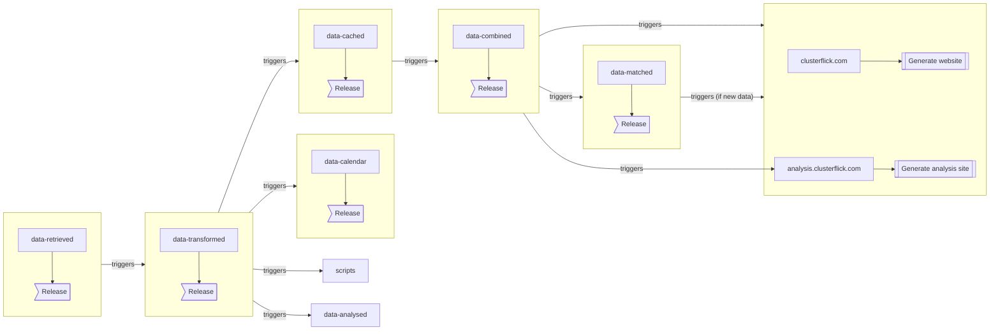

# Clusterflick

This is the Github org for the code that powers ClusterFlick 🍿

🎬 Looking to see what movies are showing? View them at https://clusterflick.com

## Build Status

1. 
2. 
   - 
   - 
   - _also triggers `scripts` and `data-analysed`_
3. 
   - 
     _(triggers website if not skipped)_
   - `clusterflick.com`
     
   - `analysis.clusterflick.com`
     

## Pipeline

```mermaid
flowchart LR
    retrieved["data-retrieved"]
    transformed["data-transformed"]
    calendar["data-calendar"]
    cached["data-cached"]
    combined["data-combined"]
    matched["data-matched"]
    scripts["scripts"]
    analysed["data-analysed"]

    subgraph retrival[" "]
        direction TB
        retrieved --> retrival-release>Release]
    end

    subgraph transformation[" "]
        direction TB
        transformed --> transformation-release>Release]
    end

    subgraph calendars[" "]
        direction TB
        calendar --> calendar-release>Release]
    end

    subgraph caching[" "]
        direction TB
        cached --> cached-release>Release]
    end

    subgraph combination[" "]
        direction TB
        combined --> combined-release>Release]
    end

    subgraph matching[" "]
        direction TB
        matched --> matched-release>Release]
    end

    subgraph website[" "]
        direction TB
        clusterflick.com --> id1[[Generate website]]
        analysis["analysis.clusterflick.com"] --> id2[[Generate analysis site]]
    end

    retrival --triggers--> transformation
    transformation --triggers--> calendars
    transformation --triggers--> caching
    transformation --triggers--> scripts
    transformation --triggers--> analysed
    caching --triggers--> combination
    combination --triggers--> matching
    combination --triggers--> website
    matching --"triggers (if new data)"--> website
    combination --triggers--> analysis

```

## Tooling Status

### Development

- `scripts`
  
- `clusterflick.com`
  

### Social Media / Spotlights

- 
- 
- 

### Data Maintenance

- 
  _(daily at 11am UTC)_
- 
  _(manual)_
- 
  _(after each transform)_
- 
  _(after each transform)_
- 
  _(after each transform)_
- 
  _(after each transform)_

### Self-hosted Runner Maintenance

- 
- 
- 

## Security Audit (zizmor)

Each repo audits its GitHub Actions workflows with [zizmor](https://docs.zizmor.sh) via the shared [`.github`](https://github.com/clusterflick/.github/blob/main/.github/workflows/zizmor.yml) reusable workflow.

### Pipeline

- 
- 
- 
- 
- 
- 
- 

### Websites

- 
- 

### Tooling

- 
- 
- 
- 
- 
