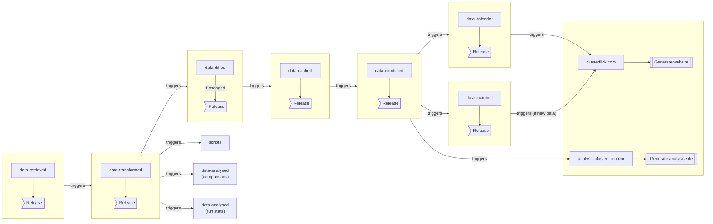

# Clusterflick

This is the Github org for the code that powers ClusterFlick 🍿

🎬 Looking to see what movies are showing? View them at https://clusterflick.com

[&labelColor=343b43>)](https://github.com/clusterflick/data-analysed/actions/workflows/venue-health.yml)
[&labelColor=343b43>)](https://github.com/clusterflick/data-analysed/actions/workflows/llm-usage-log.yml)

## Build Status

1. 
   [&labelColor=343b43>)](https://github.com/clusterflick/data-analysed/actions/workflows/workflow-run-stats.yml)
   [&labelColor=343b43>)](https://github.com/clusterflick/data-analysed/actions/workflows/workflow-run-stats.yml)
2. 
   [&labelColor=343b43>)](https://github.com/clusterflick/data-analysed/actions/workflows/workflow-run-stats.yml)
   [&labelColor=343b43>)](https://github.com/clusterflick/data-analysed/actions/workflows/workflow-run-stats.yml)
   - 
     [&labelColor=343b43>)](https://github.com/clusterflick/data-analysed/actions/workflows/workflow-run-stats.yml)
     _(only releases when something changed)_
     - 
       _(runs whether or not the diff released)_
   - _also triggers `scripts` PR and `data-analysed`_ analysis scripts
3. 
   [&labelColor=343b43>)](https://github.com/clusterflick/data-analysed/actions/workflows/workflow-run-stats.yml)
   - 
    [&labelColor=343b43>)](https://github.com/clusterflick/data-analysed/actions/workflows/workflow-run-stats.yml)
    [&labelColor=343b43>)](https://github.com/clusterflick/data-analysed/actions/workflows/workflow-run-stats.yml)
     - (only releases once per day)
   - 
     [&labelColor=343b43>)](https://github.com/clusterflick/data-analysed/actions/workflows/workflow-run-stats.yml)
      - `clusterflick.com`
        
        [&labelColor=343b43>)](https://github.com/clusterflick/data-analysed/actions/workflows/workflow-run-stats.yml)
   - `analysis.clusterflick.com`
     
     [&labelColor=343b43>)](https://github.com/clusterflick/data-analysed/actions/workflows/workflow-run-stats.yml)

## Pipeline

```mermaid
flowchart LR
    retrieved["data-retrieved"]
    transformed["data-transformed"]
    calendar["data-calendar"]
    cached["data-cached"]
    diffed["data-diffed"]
    combined["data-combined"]
    matched["data-matched"]
    scripts["scripts"]
    analysed["data-analysed<br>(comparisons)"]
    runstats["data-analysed<br>(run stats)"]

    subgraph retrival[" "]
        direction TB
        retrieved --> retrival-release>Release]
    end

    subgraph transformation[" "]
        direction TB
        transformed --> transformation-release>Release]
    end

    subgraph calendars[" "]
        direction TB
        calendar --> calendar-release>Release]
    end

    subgraph caching[" "]
        direction TB
        cached --> cached-release>Release]
    end

    subgraph diffing[" "]
        direction TB
        diffed --"if changed"--> diffed-release>Release]
    end

    subgraph combination[" "]
        direction TB
        combined --> combined-release>Release]
    end

    subgraph matching[" "]
        direction TB
        matched --> matched-release>Release]
    end

    subgraph website[" "]
        direction TB
        clusterflick.com --> id1[[Generate website]]
        analysis["analysis.clusterflick.com"] --> id2[[Generate analysis site]]
    end

    retrival --triggers--> transformation
    transformation --triggers--> diffing
    transformation --triggers--> scripts
    transformation --triggers--> analysed
    transformation --triggers--> runstats
    diffing --triggers--> caching
    caching --triggers--> combination
    combination --triggers--> calendars
    combination --triggers--> matching
    combination --triggers--> analysis
    calendars --triggers--> clusterflick.com
    matching --"triggers (if new data)"--> clusterflick.com

```

## Tooling Status

### Development

- `scripts`
  
- `clusterflick.com`
  

### Social Media / Spotlights

- 
- 
- 

### Data Maintenance

- 
  _(daily at 11am UTC)_
- 
  _(manual)_
- 
  _(after each transform)_
- [&labelColor=343b43>)](https://github.com/clusterflick/data-analysed/actions/workflows/compare-accessible-screenings.yml)
  _(after each transform)_
- [&labelColor=343b43>)](https://github.com/clusterflick/data-analysed/actions/workflows/compare-cinemaguide-screenings.yml)
  _(after each transform)_
- 
  _(after each transform)_
- 
  _(after each transform — feeds the stability badges above)_

### Self-hosted Runner Maintenance

- 
- 
- 

## Security Audit (zizmor)

Each repo audits its GitHub Actions workflows with
[zizmor](https://docs.zizmor.sh) via the shared
[`.github`](https://github.com/clusterflick/.github/blob/main/.github/workflows/zizmor.yml)
reusable workflow.

### Pipeline

- data-retrieved 
- data-transformed 
- data-calendar 
- data-cached 
- data-diffed 
- data-combined 
- data-matched 
- data-analysed 

### Websites

- clusterflick.com 
- analysis.clusterflick.com 

### Tooling

- github 
- scripts 
- generate-spotlights 
- self-hosted-workflows 
- release-downloader 
