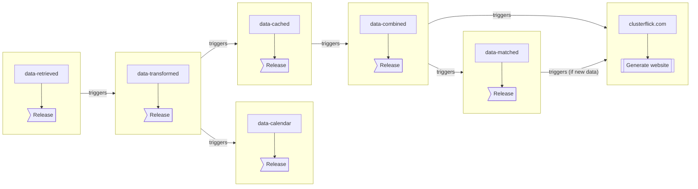

# Clusterflick

This is the Github org for the code that powers ClusterFlick 🍿

🎬 Looking to see what movies are showing? View them at https://clusterflick.com

## Build Status

1. 
2. 
   - 
   - 
3. 
   -  *(triggers website only if new data)*
   - 

## Pipeline

